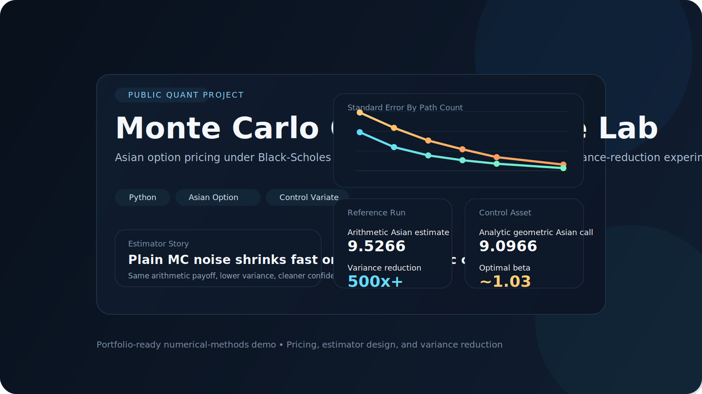
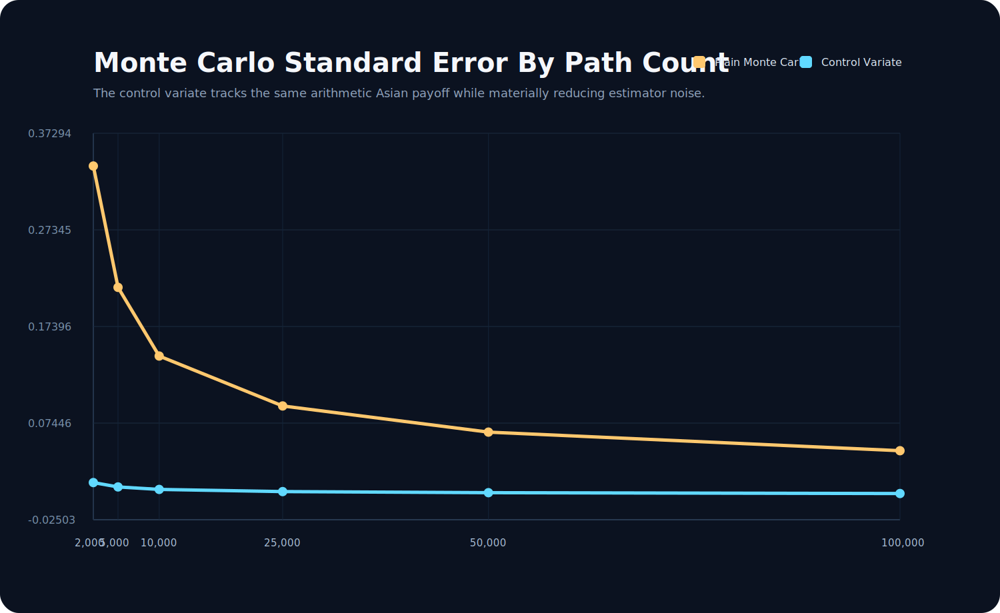
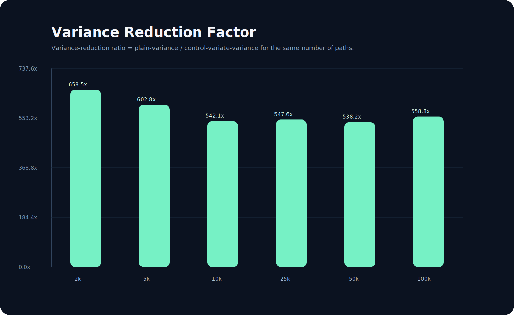
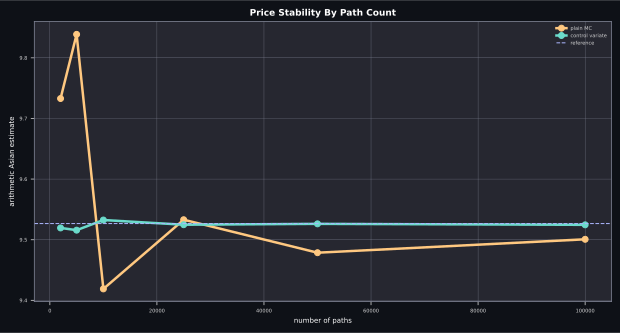
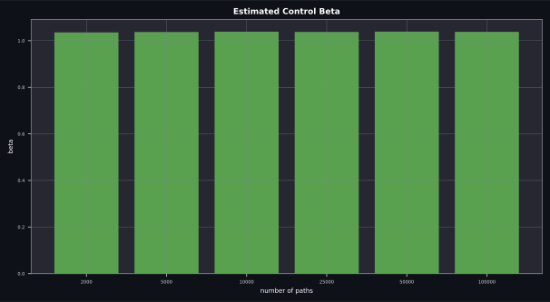

<div align="center">
  <h1>Monte Carlo Control Variate Lab</h1>
  <p><strong>A public-facing pricing project for arithmetic Asian options under Black-Scholes using a geometric-Asian control variate to reduce Monte Carlo noise.</strong></p>
  <p>Built as a compact portfolio project around experiments, estimator comparison, and visual presentation.</p>
</div>

<p align="center">
  <code>python</code>
  <code>monte carlo</code>
  <code>control variate</code>
  <code>asian option</code>
  <code>variance reduction</code>
  <code>black scholes</code>
</p>



## At A Glance

| Surface | Purpose |
| --- | --- |
| Scenario layer | Defines the Black-Scholes setup and averaging schedule |
| Analytic benchmark | Prices the geometric Asian call in closed form |
| Monte Carlo engine | Simulates arithmetic and geometric Asian payoffs on the same paths |
| Control variate estimator | Uses the analytic geometric price to reduce arithmetic-Asian variance |
| Output layer | Exports CSV, JSON, and SVG charts for GitHub-ready presentation |

## Overview

This project studies a classic variance-reduction idea in a compact, portfolio-friendly format.
The target payoff is an arithmetic Asian call, which is easy to simulate but does not admit the same clean closed-form expression as the geometric version.
That makes the geometric Asian option a natural control variate:

- it is highly correlated with the arithmetic payoff
- it can be simulated on the same paths
- it has a closed-form price under Black-Scholes

The result is a clear before-and-after experiment showing how estimator quality improves without increasing model complexity.

## Core Formulas

Under the Black-Scholes dynamics used in the repo,

```math
dS_t = r S_t\,dt + \sigma S_t\,dW_t.
```

The arithmetic and geometric averaging functionals are

```math
A_{\text{arith}} = \frac{1}{n}\sum_{i=1}^n S_{t_i},
\qquad
A_{\text{geo}} = \exp\left(\frac{1}{n}\sum_{i=1}^n \log S_{t_i}\right).
```

The target payoff is the discounted arithmetic-Asian call:

```math
X = e^{-rT}(A_{\text{arith}} - K)^+.
```

The control variate is the discounted geometric-Asian call

```math
Y = e^{-rT}(A_{\text{geo}} - K)^+,
```

whose expectation is available in closed form in this setup.

The adjusted estimator used in the project is

```math
\hat V_{\text{CV}} = \bar X - \beta(\bar Y - \mathbb{E}[Y]),
\qquad
\beta^\star = \frac{\operatorname{Cov}(X,Y)}{\operatorname{Var}(Y)}.
```

## What It Shows

- path simulation under Black-Scholes at discrete averaging times
- closed-form pricing for the geometric Asian call
- optimal-beta control variate adjustment
- standard-error comparison across path counts
- variance-reduction ratios for the same computational budget

## Quick Start

```bash
python3 -m pip install -e .
python3 -m monte_carlo_control_variate_lab
PYTHONPATH=src python3 -m unittest discover -s tests -v
```

## Generated Outputs

- `results/path_count_study.csv`
- `results/path_count_study.json`
- `results/reference_estimate.json`
- `results/price_stability_comparison.svg`
- `results/standard_error_comparison.svg`
- `results/variance_reduction_ratio.svg`
- `results/control_beta_profile.svg`

## Preview

<p align="center">
  
  
</p>
<p align="center">
  
  
</p>

## Example Results

Using the default scenario:

- analytic geometric Asian call: `9.0966`
- reference arithmetic Asian price with control variate: about `9.5266`
- variance reduction is materially positive across all tested path counts and reaches more than `500x` in the larger runs

This is exactly the story the repo is meant to tell: same payoff, same model, better estimator.

## Project Structure

```text
monte-carlo-control-variate-lab/
├── pyproject.toml
├── README.md
├── assets/
│   └── cover.svg
├── results/
├── src/monte_carlo_control_variate_lab/
│   ├── __init__.py
│   ├── __main__.py
│   ├── black_scholes.py
│   ├── charts.py
│   ├── estimators.py
│   └── experiments.py
└── tests/
    └── test_control_variate.py
```

## Notes

- The emphasis is on estimator design and result quality, not on framework complexity.
- The project is intentionally compact so the variance-reduction mechanism is easy to explain in an interview.
